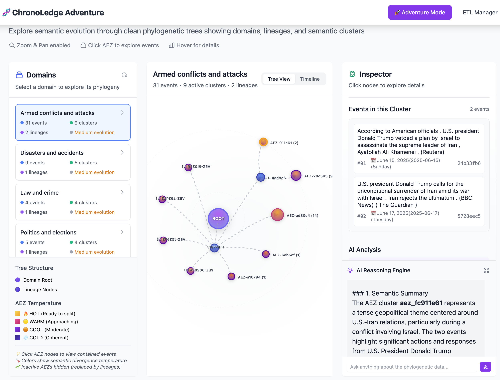
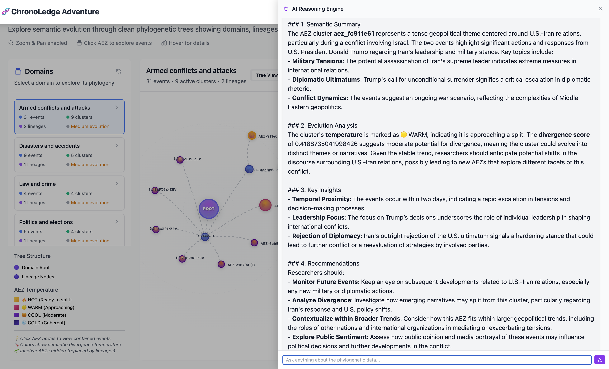

# ChronoLedge: A System for Tracking Semantic Evolution

## Introduction

**How does knowledge evolve?**  
Can we *observe*, *measure*, and *understand* how scientific paradigms shift — not just in hindsight, but as they unfold?

Philosophers like **Thomas Kuhn** offered powerful metaphors to explain the structure of scientific revolutions. But with modern tools — **language models, semantic embeddings, and graph-based reasoning** — we can now attempt something more:  **measure knowledge evolution**.

Science and day-to-day information are fragmented, fast-moving, and noisy. ChronoLedge is a step toward **visualizing the semantic landscape as it adapts**, making patterns of meaning, divergence, and convergence observable.

Can we use LLMs and embeddings to "see over the hill" and glimpse the shape of emerging concepts, long before they fully materialize?

---

## What is ChronoLedge?

ChronoLedge is a research tool designed to **track, visualize, and interact with semantic evolution** in a domain over time.

At its core, it transforms raw, time-stamped event data into a **semantic phylogenetic tree** — a structure that reflects how ideas form, diverge, and evolve.

---

## Future Vision

ChronoLedge is the **first step in a larger research effort** to model and interact with knowledge as a living, evolving structure — a **semantic operating system** that helps users:

- Understand the dynamics of scientific or societal changes
- Detect early signals of paradigm shifts
- Explore domains in a narrative, interpretable way

---

## Interface




---

## System Overview

### 1. Event Ingestion  
ChronoLedge fetches events from the [Wikipedia Current Events Portal](https://en.wikipedia.org/wiki/Portal:Current_events), parsing daily entries and structuring them as semantically annotated JSON records. Each event includes:
- Summary
- Timestamp
- Category lineage
- Embedded entities (Wikipedia links)

### 2. Phylogeny Tree Engine  
For each **event domain** (e.g., "Middle Eastern crisis", "Technology", "Elections"), the engine incrementally builds a **semantic phylogenetic tree**:

- Each new event is embedded and compared to existing **AEZs** (*Anchored Embedding Zones*)
- If similar, it's absorbed into the AEZ
- If divergent, a **new AEZ** is created
- Each AEZ tracks a **divergence score**, measuring how semantically cohesive it remains
  > This concept is inspired by *genetic drift* in evolutionary biology — as AEZs grow and accumulate new semantic material (events), internal variance may increase. If the "semantic drift" exceeds a threshold, it signals a loss of coherence, triggering a split into new evolutionary paths.

  > When an AEZ becomes semantically unstable (above a divergence threshold), it **splits**:
  > - The current AEZ becomes a **lineage node** (ancestor)
  > - Two new child AEZs are born, each inheriting a distinct semantic thread (sharing a common ancestor)

  > ### **AEZ Evolution Cycle**

  > 1. **Speciation**: Created when first event doesn't match existing AEZs
  > 2. **Expansion**: Accumulates semantically similar events
  > 3. **Stabilization**: Reaches stable size with coherent semantic focus
  > 4. **Semantic Drift Phase**: Internal diversity increases as new event types join
  > 5. **Semantic Speciation**: Divergence threshold exceeded, AEZ becomes inactive
  > 6. **Ancestral**: Replaced by lineage node with two child AEZs

This results in an evolving, **branching structure of knowledge**, with events as leaves and AEZs as internal nodes — reminiscent of a **cognitive phylogeny**.

### 3. Reasoning Module  
ChronoLedge integrates a **semantic retrieval and reasoning system** powered by LLMs.  
It can:
- Answer questions about domains or specific lineages
- Narrate the evolution of a topic over time
- Identify convergence/divergence points
- Suggest plausible future semantic branches

This module is built using RAG (Retrieval-Augmented Generation), grounding LLMs in the actual AEZ and event graph.

---

## Features

-  **Semantic timeline** built from real-world events
-  **Phylogeny engine** for AEZ-based evolution tracking
-  **Divergence score** calculation for semantic cohesion
-  **Visual explorer** with lineage trees and event mapping
-  **LLM-powered analysis** (RAG) to interpret and traverse evolving knowledge

---

## Repository Structure

```bash
chronoledge/
├── etl/            # Fetch and parse Wikipedia events; semantic engine to load phylogeny tree 
├── core/           # config and LLM reasoning
└── frontend/       # Frontend to interact with ETL and Engine
data/
├── event_metadata.jsonl
├── events/
└── extraction_metadata.json
logs/
output/
└── phylogeny_state.json
tutorial /          # Screen shots of the web app 
README.md
requirements.txt
```


## 🚀 Getting Started

### 1. **Install the requirements**
```bash
pip install -r requirements.txt
```

### 2. **Add Keys to config.py**
Open and edit the config file, adding OpenAI/Claude API key and ScrapeAPI key
```bash
chronoledge/core/config.py
```

### 3. **Start the Application**
```bash
cd chronoledge
python -m uvicorn main:app --reload --host 0.0.0.0 --port 8000
```
